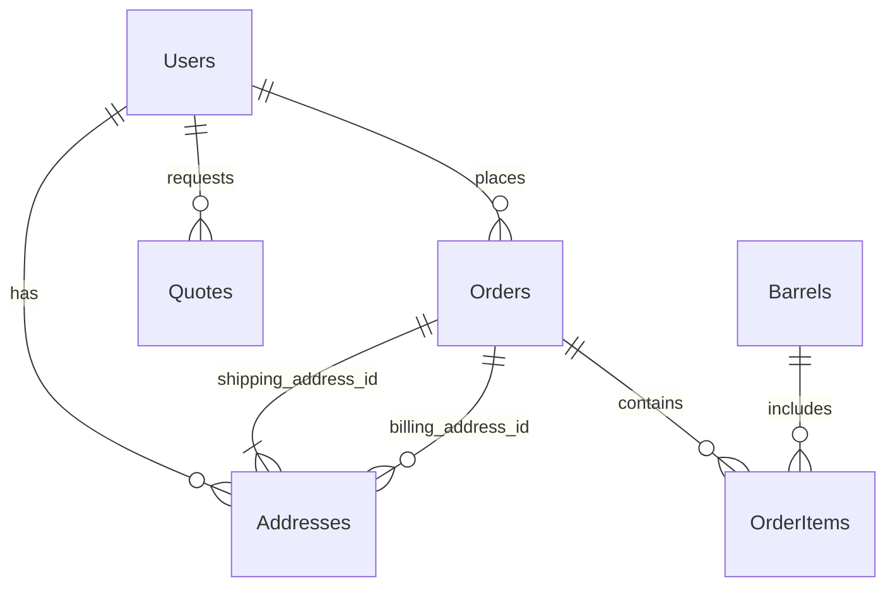

### **Conception Détaillée du Schéma de Base de Données - Millésime Sans Frontières**

**Version:** 1.1
**Date:** 27/08/2025

**1. Objectif**

Ce document détaille le schéma de la base de données pour le backend de l'application Millésime Sans Frontières. Il définit la structure de chaque table, les types de données des colonnes, les contraintes (clés primaires, clés étrangères, unicité, non-nullité) et les relations entre les tables.

**2. Base de Données Choisie**

*   **Type:** PostgreSQL (confirmé)

**3. Conventions de Nommage**

*   **Tables:** Noms au pluriel, en PascalCase (ex: `Users`, `Barrels`).
*   **Colonnes:** Noms en snake_case (ex: `first_name`, `created_at`).
*   **Clés Primaires:** `id` (UUID).
*   **Clés Étrangères:** `related_table_id` (ex: `user_id`).

**4. Définition des Tables**

---

#### **Table: `Users`**

**Description:** Stocke les informations des utilisateurs (clients B2C, clients B2B, administrateurs).

| Nom de Colonne | Type de Donnée          | Contraintes                               | Description                                     |
| :------------- | :---------------------- | :---------------------------------------- | :---------------------------------------------- |
| `id`           | `UUID`                  | `PRIMARY KEY`, `DEFAULT gen_random_uuid()` | Identifiant unique de l'utilisateur             |
| `email`        | `VARCHAR(255)`          | `NOT NULL`, `UNIQUE`                      | Adresse email de l'utilisateur (login)          |
| `password_hash`| `VARCHAR(255)`          | `NOT NULL`                                | Hash du mot de passe de l'utilisateur           |
| `role`         | `VARCHAR(50)`           | `NOT NULL`, `DEFAULT 'b2c'`               | Rôle de l'utilisateur (`admin`, `b2b`, `b2c`)   |
| `first_name`   | `VARCHAR(100)`          | `NULLABLE`                                | Prénom de l'utilisateur                         |
| `last_name`    | `VARCHAR(100)`          | `NULLABLE`                                | Nom de famille de l'utilisateur                 |
| `company_name` | `VARCHAR(255)`          | `NULLABLE`                                | Nom de l'entreprise (pour les clients B2B)      |
| `phone_number` | `VARCHAR(50)`           | `NULLABLE`                                | Numéro de téléphone                             |
| `is_active`    | `BOOLEAN`               | `NOT NULL`, `DEFAULT TRUE`                | Indique si le compte est actif                  |
| `created_at`   | `TIMESTAMP WITH TIME ZONE`| `NOT NULL`, `DEFAULT NOW()`               | Date et heure de création de l'utilisateur      |
| `updated_at`   | `TIMESTAMP WITH TIME ZONE`| `NOT NULL`, `DEFAULT NOW()`               | Date et heure de dernière mise à jour           |

---

#### **Table: `Addresses`**

**Description:** Stocke les adresses de livraison et de facturation.

| Nom de Colonne | Type de Donnée          | Contraintes                               | Description                                     |
| :------------- | :---------------------- | :---------------------------------------- | :---------------------------------------------- |
| `id`           | `UUID`                  | `PRIMARY KEY`, `DEFAULT gen_random_uuid()` | Identifiant unique de l'adresse                 |
| `user_id`      | `UUID`                  | `NOT NULL`, `FOREIGN KEY (Users.id)`      | Utilisateur auquel l'adresse est associée       |
| `address_line1`| `VARCHAR(255)`          | `NOT NULL`                                | Première ligne de l'adresse                     |
| `address_line2`| `VARCHAR(255)`          | `NULLABLE`                                | Seconde ligne de l'adresse (optionnel)          |
| `city`         | `VARCHAR(100)`          | `NOT NULL`                                | Ville                                           |
| `state_province`| `VARCHAR(100)`          | `NULLABLE`                                | État/Province (si applicable)                   |
| `zip_code`     | `VARCHAR(20)`           | `NOT NULL`                                | Code postal                                     |
| `country`      | `VARCHAR(100)`          | `NOT NULL`                                | Pays                                            |
| `is_default`   | `BOOLEAN`               | `NOT NULL`, `DEFAULT FALSE`               | Indique si c'est l'adresse par défaut           |
| `created_at`   | `TIMESTAMP WITH TIME ZONE`| `NOT NULL`, `DEFAULT NOW()`               | Date et heure de création de l'adresse          |
| `updated_at`   | `TIMESTAMP WITH TIME ZONE`| `NOT NULL`, `DEFAULT NOW()`               | Date et heure de dernière mise à jour           |

---

#### **Table: `Barrels`**

**Description:** Stocke les informations détaillées sur les fûts disponibles à la vente.

| Nom de Colonne | Type de Donnée          | Contraintes                               | Description                                     |
| :------------- | :---------------------- | :---------------------------------------- | :---------------------------------------------- |
| `id`           | `UUID`                  | `PRIMARY KEY`, `DEFAULT gen_random_uuid()` | Identifiant unique du fût                       |
| `name`         | `VARCHAR(255)`          | `NOT NULL`                                | Nom du fût (ex: "Fût Chêne Français Ex-Vin Rouge")|
| `origin_country`| `VARCHAR(100)`          | `NOT NULL`                                | Pays d'origine du fût                           |
| `previous_content`| `VARCHAR(100)`          | `NOT NULL`                                | Contenu précédent du fût (ex: "Vin Rouge", "Bourbon")|
| `volume_liters`| `NUMERIC(10, 2)`        | `NOT NULL`                                | Volume du fût en litres                         |
| `wood_type`    | `VARCHAR(100)`          | `NOT NULL`                                | Type de bois (ex: "Chêne Français", "Chêne Américain")|
| `condition`    | `VARCHAR(50)`           | `NOT NULL`                                | État du fût (ex: "Neuf", "Reconditionné", "Usagé")|
| `price`        | `NUMERIC(10, 2)`        | `NOT NULL`                                | Prix unitaire du fût                            |
| `stock_quantity`| `INTEGER`               | `NOT NULL`, `DEFAULT 0`                   | Quantité en stock                               |
| `description`  | `TEXT`                  | `NULLABLE`                                | Description détaillée du fût                    |
| `image_urls`   | `TEXT[]`                | `NULLABLE`                                | Tableau d'URLs des images du fût                |
| `dimensions`   | `VARCHAR(255)`          | `NULLABLE`                                | Dimensions physiques du fût                     |
| `weight_kg`    | `NUMERIC(10, 2)`        | `NULLABLE`                                | Poids du fût en kg                              |
| `created_at`   | `TIMESTAMP WITH TIME ZONE`| `NOT NULL`, `DEFAULT NOW()`               | Date et heure d'ajout du fût                    |
| `updated_at`   | `TIMESTAMP WITH TIME ZONE`| `NOT NULL`, `DEFAULT NOW()`               | Date et heure de dernière mise à jour           |

---

#### **Table: `Orders`**

**Description:** Enregistre les commandes passées par les utilisateurs.

| Nom de Colonne | Type de Donnée          | Contraintes                               | Description                                     |
| :------------- | :---------------------- | :---------------------------------------- | :---------------------------------------------- |
| `id`           | `UUID`                  | `PRIMARY KEY`, `DEFAULT gen_random_uuid()` | Identifiant unique de la commande               |
| `user_id`      | `UUID`                  | `NOT NULL`, `FOREIGN KEY (Users.id)`      | Utilisateur ayant passé la commande             |
| `order_date`   | `TIMESTAMP WITH TIME ZONE`| `NOT NULL`, `DEFAULT NOW()`               | Date et heure de la commande                    |
| `total_amount` | `NUMERIC(10, 2)`        | `NOT NULL`                                | Montant total de la commande                     |
| `status`       | `VARCHAR(50)`           | `NOT NULL`, `DEFAULT 'pending'`           | Statut de la commande (ex: `pending`, `processing`, `shipped`, `delivered`, `cancelled`)|
| `shipping_address_id`| `UUID`                  | `NOT NULL`, `FOREIGN KEY (Addresses.id)`  | Adresse de livraison de la commande             |
| `billing_address_id`| `UUID`                  | `NULLABLE`, `FOREIGN KEY (Addresses.id)`  | Adresse de facturation (si différente)          |
| `payment_status`| `VARCHAR(50)`           | `NOT NULL`, `DEFAULT 'pending'`           | Statut du paiement (ex: `pending`, `paid`, `refunded`)|
| `payment_method`| `VARCHAR(50)`           | `NULLABLE`                                | Méthode de paiement utilisée                    |
| `tracking_number`| `VARCHAR(255)`          | `NULLABLE`                                | Numéro de suivi de l'expédition                 |
| `notes`        | `TEXT`                  | `NULLABLE`                                | Notes internes sur la commande                  |
| `updated_at`   | `TIMESTAMP WITH TIME ZONE`| `NOT NULL`, `DEFAULT NOW()`               | Date et heure de dernière mise à jour           |

---

#### **Table: `OrderItems`**

**Description:** Détaille les articles inclus dans chaque commande.

| Nom de Colonne | Type de Donnée          | Contraintes                               | Description                                     |
| :------------- | :---------------------- | :---------------------------------------- | :---------------------------------------------- |
| `id`           | `UUID`                  | `PRIMARY KEY`, `DEFAULT gen_random_uuid()` | Identifiant unique de l'article de commande     |
| `order_id`     | `UUID`                  | `NOT NULL`, `FOREIGN KEY (Orders.id)`     | Commande à laquelle l'article appartient        |
| `barrel_id`    | `UUID`                  | `NOT NULL`, `FOREIGN KEY (Barrels.id)`    | Fût commandé                                    |
| `quantity`     | `INTEGER`               | `NOT NULL`, `DEFAULT 1`                   | Quantité du fût commandé                        |
| `price_at_purchase`| `NUMERIC(10, 2)`        | `NOT NULL`                                | Prix du fût au moment de l'achat                |

---

#### **Table: `Quotes`**

**Description:** Enregistre les demandes de devis des clients B2B.

| Nom de Colonne | Type de Donnée          | Contraintes                               | Description                                     |
| :------------- | :---------------------- | :---------------------------------------- | :---------------------------------------------- |
| `id`           | `UUID`                  | `PRIMARY KEY`, `DEFAULT gen_random_uuid()` | Identifiant unique du devis                     |
| `user_id`      | `UUID`                  | `NOT NULL`, `FOREIGN KEY (Users.id)`      | Utilisateur ayant demandé le devis              |
| `request_date` | `TIMESTAMP WITH TIME ZONE`| `NOT NULL`, `DEFAULT NOW()`               | Date et heure de la demande de devis            |
| `status`       | `VARCHAR(50)`           | `NOT NULL`, `DEFAULT 'pending'`           | Statut du devis (ex: `pending`, `approved`, `rejected`, ``converted_to_order`)
| `requested_items`| `JSONB`                 | `NOT NULL`                                | Détail des fûts et quantités demandées (JSON)   |
| `quoted_price` | `NUMERIC(10, 2)`        | `NULLABLE`                                | Prix proposé dans le devis                      |
| `notes`        | `TEXT`                  | `NULLABLE`                                | Notes internes ou commentaires sur le devis     |
| `valid_until`  | `TIMESTAMP WITH TIME ZONE`| `NULLABLE`                                | Date de validité du devis                       |
| `updated_at`   | `TIMESTAMP WITH TIME ZONE`| `NOT NULL`, `DEFAULT NOW()`               | Date et heure de dernière mise à jour           |

---

**5. Relations entre les Tables (Clés Étrangères)**

*   `Users` 1:N `Addresses` (un utilisateur peut avoir plusieurs adresses)
*   `Users` 1:N `Orders` (un utilisateur peut passer plusieurs commandes)
*   `Users` 1:N `Quotes` (un utilisateur peut demander plusieurs devis)
*   `Orders` 1:N `OrderItems` (une commande contient plusieurs articles)
*   `Barrels` 1:N `OrderItems` (un fût peut être dans plusieurs articles de commande)
*   `Orders` 1:1 `Addresses` (une commande a une adresse de livraison et potentiellement une de facturation)

**6. Index (pour l'optimisation des performances)**

*   `Users`: Index sur `email` (pour les recherches de connexion).
*   `Orders`: Index sur `user_id` et `order_date` (pour les recherches d'historique de commandes).
*   `Barrels`: Index sur `origin_country`, `previous_content`, `volume_liters`, `wood_type` (pour les filtres de recherche).
*   `Addresses`: Index sur `user_id`.
*   `Quotes`: Index sur `user_id` et `request_date`.