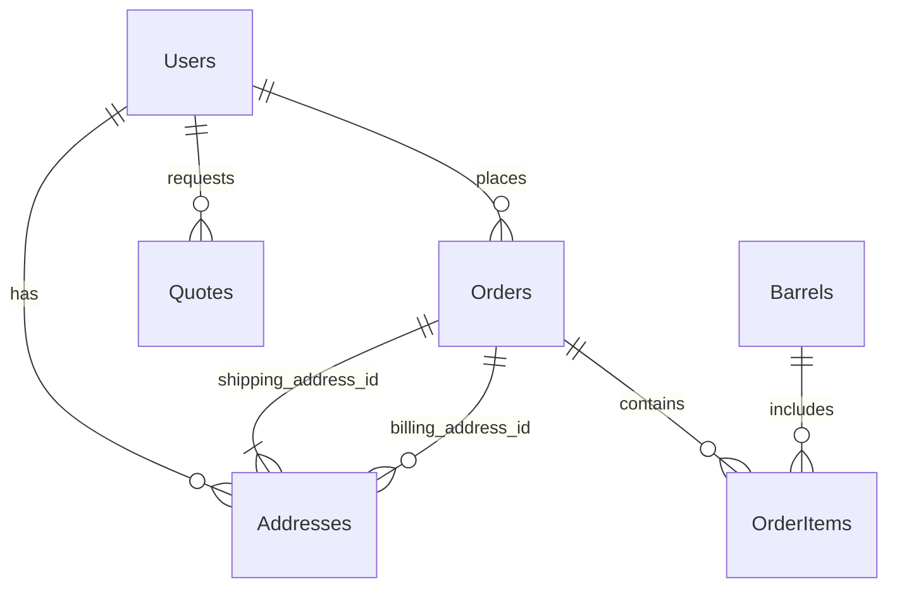

### **Detailed Database Schema Design - Millésime Sans Frontières**

**Version:** 1.1
**Date:** 08/27/2025

**1. Objective**

This document details the database schema for the backend of the Millésime Sans Frontières application. It defines the structure of each table, the data types of the columns, the constraints (primary keys, foreign keys, uniqueness, non-nullability), and the relationships between the tables.

**2. Chosen Database**

*   **Type:** PostgreSQL (confirmed)

**3. Naming Conventions**

*   **Tables:** Plural nouns, in PascalCase (e.g., `Users`, `Barrels`).
*   **Columns:** Names in snake_case (e.g., `first_name`, `created_at`).
*   **Primary Keys:** `id` (UUID).
*   **Foreign Keys:** `related_table_id` (e.g., `user_id`).

**4. Table Definitions**

---

#### **Table: `Users`**

**Description:** Stores information about users (B2C clients, B2B clients, administrators).

| Column Name    | Data Type               | Constraints                               | Description                                     |
| :------------- | :---------------------- | :---------------------------------------- | :---------------------------------------------- |
| `id`           | `UUID`                  | `PRIMARY KEY`, `DEFAULT gen_random_uuid()` | Unique identifier for the user                  |
| `email`        | `VARCHAR(255)`          | `NOT NULL`, `UNIQUE`                      | User's email address (login)                    |
| `password_hash`| `VARCHAR(255)`          | `NOT NULL`                                | Hash of the user's password                     |
| `role`         | `VARCHAR(50)`           | `NOT NULL`, `DEFAULT 'b2c'`               | User's role (`admin`, `b2b`, `b2c`)             |
| `first_name`   | `VARCHAR(100)`          | `NULLABLE`                                | User's first name                               |
| `last_name`    | `VARCHAR(100)`          | `NULLABLE`                                | User's last name                                |
| `company_name` | `VARCHAR(255)`          | `NULLABLE`                                | Company name (for B2B clients)                  |
| `phone_number` | `VARCHAR(50)`           | `NULLABLE`                                | Phone number                                    |
| `is_active`    | `BOOLEAN`               | `NOT NULL`, `DEFAULT TRUE`                | Indicates if the account is active              |
| `created_at`   | `TIMESTAMP WITH TIME ZONE`| `NOT NULL`, `DEFAULT NOW()`               | Date and time of user creation                  |
| `updated_at`   | `TIMESTAMP WITH TIME ZONE`| `NOT NULL`, `DEFAULT NOW()`               | Date and time of the last update                |

---

#### **Table: `Addresses`**

**Description:** Stores shipping and billing addresses.

| Column Name    | Data Type               | Constraints                               | Description                                     |
| :------------- | :---------------------- | :---------------------------------------- | :---------------------------------------------- |
| `id`           | `UUID`                  | `PRIMARY KEY`, `DEFAULT gen_random_uuid()` | Unique identifier for the address               |
| `user_id`      | `UUID`                  | `NOT NULL`, `FOREIGN KEY (Users.id)`      | User to whom the address is associated          |
| `address_line1`| `VARCHAR(255)`          | `NOT NULL`                                | First line of the address                       |
| `address_line2`| `VARCHAR(255)`          | `NULLABLE`                                | Second line of the address (optional)           |
| `city`         | `VARCHAR(100)`          | `NOT NULL`                                | City                                            |
| `state_province`| `VARCHAR(100)`          | `NULLABLE`                                | State/Province (if applicable)                  |
| `zip_code`     | `VARCHAR(20)`           | `NOT NULL`                                | Postal code                                     |
| `country`      | `VARCHAR(100)`          | `NOT NULL`                                | Country                                         |
| `is_default`   | `BOOLEAN`               | `NOT NULL`, `DEFAULT FALSE`               | Indicates if this is the default address        |
| `created_at`   | `TIMESTAMP WITH TIME ZONE`| `NOT NULL`, `DEFAULT NOW()`               | Date and time of address creation               |
| `updated_at`   | `TIMESTAMP WITH TIME ZONE`| `NOT NULL`, `DEFAULT NOW()`               | Date and time of the last update                |

---

#### **Table: `Barrels`**

**Description:** Stores detailed information about the barrels available for sale.

| Column Name    | Data Type               | Constraints                               | Description                                     |
| :------------- | :---------------------- | :---------------------------------------- | :---------------------------------------------- |
| `id`           | `UUID`                  | `PRIMARY KEY`, `DEFAULT gen_random_uuid()` | Unique identifier for the barrel                |
| `name`         | `VARCHAR(255)`          | `NOT NULL`                                | Name of the barrel (e.g., "Ex-Red Wine French Oak Barrel")|
| `origin_country`| `VARCHAR(100)`          | `NOT NULL`                                | Barrel's country of origin                      |
| `previous_content`| `VARCHAR(100)`          | `NOT NULL`                                | Previous content of the barrel (e.g., "Red Wine", "Bourbon")|
| `volume_liters`| `NUMERIC(10, 2)`        | `NOT NULL`                                | Volume of the barrel in liters                  |
| `wood_type`    | `VARCHAR(100)`          | `NOT NULL`                                | Type of wood (e.g., "French Oak", "American Oak")|
| `condition`    | `VARCHAR(50)`           | `NOT NULL`                                | Condition of the barrel (e.g., "New", "Refurbished", "Used")|
| `price`        | `NUMERIC(10, 2)`        | `NOT NULL`                                | Unit price of the barrel                        |
| `stock_quantity`| `INTEGER`               | `NOT NULL`, `DEFAULT 0`                   | Quantity in stock                               |
| `description`  | `TEXT`                  | `NULLABLE`                                | Detailed description of the barrel              |
| `image_urls`   | `TEXT[]`                | `NULLABLE`                                | Array of URLs for the barrel's images           |
| `dimensions`   | `VARCHAR(255)`          | `NULLABLE`                                | Physical dimensions of the barrel               |
| `weight_kg`    | `NUMERIC(10, 2)`        | `NULLABLE`                                | Weight of the barrel in kg                      |
| `created_at`   | `TIMESTAMP WITH TIME ZONE`| `NOT NULL`, `DEFAULT NOW()`               | Date and time the barrel was added              |
| `updated_at`   | `TIMESTAMP WITH TIME ZONE`| `NOT NULL`, `DEFAULT NOW()`               | Date and time of the last update                |

---

#### **Table: `Orders`**

**Description:** Records orders placed by users.

| Column Name    | Data Type               | Constraints                               | Description                                     |
| :------------- | :---------------------- | :---------------------------------------- | :---------------------------------------------- |
| `id`           | `UUID`                  | `PRIMARY KEY`, `DEFAULT gen_random_uuid()` | Unique identifier for the order                 |
| `user_id`      | `UUID`                  | `NOT NULL`, `FOREIGN KEY (Users.id)`      | User who placed the order                       |
| `order_date`   | `TIMESTAMP WITH TIME ZONE`| `NOT NULL`, `DEFAULT NOW()`               | Date and time of the order                      |
| `total_amount` | `NUMERIC(10, 2)`        | `NOT NULL`                                | Total amount of the order                       |
| `status`       | `VARCHAR(50)`           | `NOT NULL`, `DEFAULT 'pending'`           | Status of the order (e.g., `pending`, `processing`, `shipped`, `delivered`, `cancelled`)|
| `shipping_address_id`| `UUID`                  | `NOT NULL`, `FOREIGN KEY (Addresses.id)`  | Shipping address for the order                  |
| `billing_address_id`| `UUID`                  | `NULLABLE`, `FOREIGN KEY (Addresses.id)`  | Billing address (if different)                  |
| `payment_status`| `VARCHAR(50)`           | `NOT NULL`, `DEFAULT 'pending'`           | Payment status (e.g., `pending`, `paid`, `refunded`)|
| `payment_method`| `VARCHAR(50)`           | `NULLABLE`                                | Payment method used                             |
| `tracking_number`| `VARCHAR(255)`          | `NULLABLE`                                | Shipping tracking number                        |
| `notes`        | `TEXT`                  | `NULLABLE`                                | Internal notes about the order                  |
| `updated_at`   | `TIMESTAMP WITH TIME ZONE`| `NOT NULL`, `DEFAULT NOW()`               | Date and time of the last update                |

---

#### **Table: `OrderItems`**

**Description:** Details the items included in each order.

| Column Name    | Data Type               | Constraints                               | Description                                     |
| :------------- | :---------------------- | :---------------------------------------- | :---------------------------------------------- |
| `id`           | `UUID`                  | `PRIMARY KEY`, `DEFAULT gen_random_uuid()` | Unique identifier for the order item            |
| `order_id`     | `UUID`                  | `NOT NULL`, `FOREIGN KEY (Orders.id)`     | Order to which the item belongs                 |
| `barrel_id`    | `UUID`                  | `NOT NULL`, `FOREIGN KEY (Barrels.id)`    | Ordered barrel                                  |
| `quantity`     | `INTEGER`               | `NOT NULL`, `DEFAULT 1`                   | Quantity of the ordered barrel                  |
| `price_at_purchase`| `NUMERIC(10, 2)`        | `NOT NULL`                                | Price of the barrel at the time of purchase     |

---

#### **Table: `Quotes`**

**Description:** Records quote requests from B2B clients.

| Column Name    | Data Type               | Constraints                               | Description                                     |
| :------------- | :---------------------- | :---------------------------------------- | :---------------------------------------------- |
| `id`           | `UUID`                  | `PRIMARY KEY`, `DEFAULT gen_random_uuid()` | Unique identifier for the quote                 |
| `user_id`      | `UUID`                  | `NOT NULL`, `FOREIGN KEY (Users.id)`      | User who requested the quote                    |
| `request_date` | `TIMESTAMP WITH TIME ZONE`| `NOT NULL`, `DEFAULT NOW()`               | Date and time of the quote request              |
| `status`       | `VARCHAR(50)`           | `NOT NULL`, `DEFAULT 'pending'`           | Status of the quote (e.g., `pending`, `approved`, `rejected`, `converted_to_order`)|
| `requested_items`| `JSONB`                 | `NOT NULL`                                | Details of requested barrels and quantities (JSON)|
| `quoted_price` | `NUMERIC(10, 2)`        | `NULLABLE`                                | Price proposed in the quote                     |
| `notes`        | `TEXT`                  | `NULLABLE`                                | Internal notes or comments on the quote         |
| `valid_until`  | `TIMESTAMP WITH TIME ZONE`| `NULLABLE`                                | Expiration date of the quote                    |
| `updated_at`   | `TIMESTAMP WITH TIME ZONE`| `NOT NULL`, `DEFAULT NOW()`               | Date and time of the last update                |

---

**5. Relationships between Tables (Foreign Keys)**

*   `Users` 1:N `Addresses` (a user can have multiple addresses)
*   `Users` 1:N `Orders` (a user can place multiple orders)
*   `Users` 1:N `Quotes` (a user can request multiple quotes)
*   `Orders` 1:N `OrderItems` (an order contains multiple items)
*   `Barrels` 1:N `OrderItems` (a barrel can be in multiple order items)
*   `Orders` 1:1 `Addresses` (an order has one shipping address and potentially one billing address)

**6. Indexes (for performance optimization)**

*   `Users`: Index on `email` (for login lookups).
*   `Orders`: Index on `user_id` and `order_date` (for order history searches).
*   `Barrels`: Index on `origin_country`, `previous_content`, `volume_liters`, `wood_type` (for search filters).
*   `Addresses`: Index on `user_id`.
*   `Quotes`: Index on `user_id` and `request_date`.